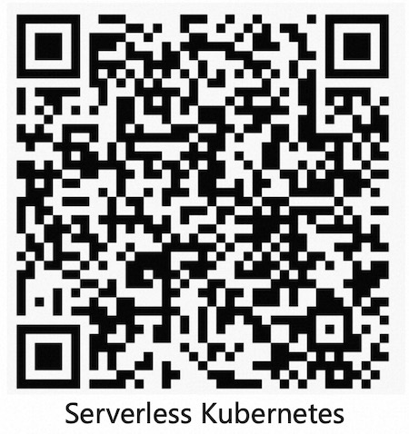

## Serverless Kubernetes Examples

[Serverless Kubernetes](https://www.aliyun.com/product/kubernetes) is part of Container Service for Alibaba Cloud. It enable you to run Kubernetes application without effort for managing servers or clusters. Serverless Kubernetes lets you focus on building your applications instead of managing the infrastructure.

This directory contains a number of examples of how to run real applications with Serverless Kubernetes of Alibaba Cloud


## Quick Start

Create the Serverless Kubernetes and copy the cluster config file to  ```~/.kube/config```


## Create NAT Gateway (Suggested)

Create NAT Gateway if you want to pull image from internet (e.g. Docker Hub), or your applications want to access internet.


## Featured samples

* [wordpress](./wordpress) - Official wordpress sample without PVC
* [wordpress-pvc](./Wordpress-pvc) - Official wordpress sample with PVC
* [wordpress-eip](./Wordpress-eip) - Wordpress sample with EIP
* [nginx-arm](./nginx-arm) - Arm-based Nginx sample
* [ingress-alb](./ingress-alb) - Simple web application with Application Load Balancer

## Community

Join the DingTalk Group



